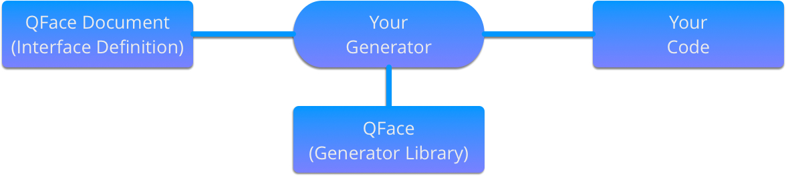

=====
Usage
=====

Concept
=======

QFace requires one or more IDL files as input file and a custom generator to produce output files. The IDL files are named QFace interface documents.

To use QFace you need to write your own generator. A generator is a small rules document which reads the QFace document and writes code using template files.

.. code-block:: yaml

    # rules-qface.yaml
    project:
        interface:
            - {{interface}}.h: interface.h
            - {{interface}}.h: interface.cpp
            - Makefile: Makefile

You then call the script using the qface executable.

.. code-block:: sh

    qface --rules rules-qface.yaml --target output echo.qface

Code Generation Principle
=========================

The code generation is driven by a rules document which applies the domain model and writes files using the Python Jinja template language.

.. note:: Refer to http://jinja.pocoo.org and particularly the template designer documentation at http://jinja.pocoo.org/docs/dev/templates/.

.. code-block:: yaml

    project:
        system:
            - project_report.csv: report.tpl

The qface executable reads the input qface files and converts them into a domain model. The domain model is then passed into the rules document. Inside the rules document you specify scopes and matches. If a ``system`` is specified as the match the ``system`` is passed into the given template documents.

.. code-block:: jinja

    {# templates/report.tpl #}
    
        
        INTERFACE, {{module}}.{{interface}}
        
        
        STRUCT , {{module}}.{{struct}}
        
        
        ENUM   , {{module}}.{{enum}}
        
    

The template iterates over the domain objects and generates text which is written into the output file in the given target folder.

You call the yaml document by calling the qface executable and provide the rules document as also the output document. The domain model is created based on the given input files.

.. code-block:: sh

    qface --rules rules-qface.yaml --target output echo.qface

To know more about the different options just ask the help of qface.

.. code-block:: sh

    qface --help

    Usage: qface [OPTIONS] [SOURCE]...

    Options:
      --rules PATH
      --target DIRECTORY
      --reload / --no-reload      Auto reload script on changes
      --scaffold / --no-scaffold  Add extrac scaffolding code
      --watch DIRECTORY
      --feature TEXT
      --run TEXT                  run script after generation
      --force / --no-force        forces overwriting of files
      --help                      Show this message and exit.
