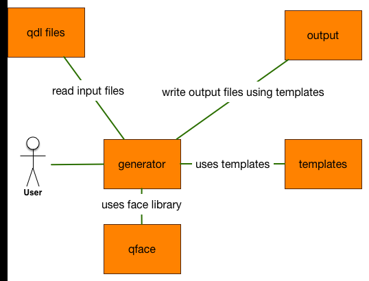

=====
Usage
=====

Concept
=======

QFace requires one or more IDL files as input file and a generator to produce output files. The IDL files are named QDL (Qt definition language).

There are several ways to call the generator.

Invocation
==========

Direct Invocation
-----------------

You can call the generator directly by using the provided script. All generator should at minimum expect a series of inputs and one output path. This is normally recommended for production.

.. code-block:: sh

    ./csv.py src dst

Via qface invokation
--------------------

You can invoke your generator using the qface helper script. This allows you also to use some specific developer support. It is recommended way during generator development.

To use an existing generator just provide the path to the generator script.

.. code-block:: sh

    qface generate --generator ./csvgen.py input output

To use live reloading on changes just use the reload option:

.. code-block:: sh

    qface generate --generator ./csvgen.py input output --reload

This will observe the generator folder and the input folder for changes and re-run the generator.

Configuration Invokation
------------------------

You can also create a YAML configuration file (for example csv.yaml):

.. code-block:: yaml

    generator: ./csvgen.py
    input: input
    output: output
    reload: false

And then call the client with:

.. code-block:: sh

    qface generate --config csv.yaml

Code Generation Principle
=========================

The code generation is driven by a small script which iterates over the domain model and writes files using a template language (see http://jinja.pocoo.org) and espcially the template designer documentation (http://jinja.pocoo.org/docs/dev/templates/).

.. code-block:: python

    from qface.generator import FileSystem, Generator

    def generate(input, output):
        system = FileSystem.parse_dir(input)
        generator = Generator(searchpath='templates')
        ctx = {'output': output, 'system': system}
        generator.write('{{output}}/modules.csv', 'modules.csv', ctx)

This script reads the input directory returns a system object form the domain model. This is used as the root object for the code generation inside the template language.

.. code-block:: jinja

    
        
        SERVICE, {{module}}.{{interface}}
        
        
        STRUCT , {{module}}.{{struct}}
        
        
        ENUM   , {{module}}.{{enum}}
        
    

The template iterates over the domain objects and generates text which is written into a file. The file name is also adjustable using the same template language.
